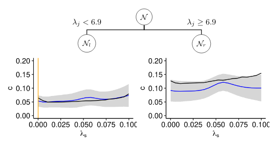

# Explaining Hyperparameter Optimization via PDPs

<!-- -->

This repository gives access to an implementation of the methods presented in the paper submission "Explaining Hyperparameter Optimization via PDPs", as well as all code that was used for the experimental analysis. 

This repository is structured as follows: 

```
    ├── analysis/               # Scripts used to create figures and tables in the paper
    ├── data/                   # Location where all experimental data is stored
    │   ├── raw/                # Raw datasets for the DNN surrogate benchmark
    │   ├── runs/               # Individual runs 
    ├── experiments/            # Code for experimental analysis (section 6)
    │   ├── synthetic           # Synthetic benchmark (section 6.1)
    │   ├── mlp                 # DNN surrogate benchmark (section 6.2)
    ├── renv/                   # renv configuration files to enable a reproducible setup 
    ├── R/                      # Implementation of methods 
    ├── LICENSE
    └── README.md               
```    

## Reproducible Setup 

To allow for a proper, reproducible setup of the environment we use the package `renv`. 

The project dependencies can be installed via 


```r
library("renv")
renv::restore()
```

```
## * The library is already synchronized with the lockfile.
```

## Quick Start  


```r
# Loading all scripts we need
source("R/tree_splitting.R")
source("R/helper.R")
source("R/marginal_effect.R")
source("R/plot_functions.R")
```

First, assume we have a surrogate model that we want to analyze. 

Here, for example, we tuned a support vector machine on the `iris` task, and extracted the surrogate model after the last iteration. 


```r
library(mlr)
library(mlrMBO)
library(e1071)

par.set = makeParamSet(
  makeNumericParam("cost", -15, 15, trafo = function(x) 2^x),
  makeNumericParam("gamma", -15, 15, trafo = function(x) 2^x)
)

ctrl = makeMBOControl()
ctrl = setMBOControlInfill(ctrl, crit = makeMBOInfillCritCB(cb.lambda = 1))
ctrl = setMBOControlTermination(ctrl, iters = 5)
tune.ctrl = makeTuneControlMBO(mbo.control = ctrl)
res = tuneParams(makeLearner("classif.svm"), iris.task, cv3, par.set = par.set, control = tune.ctrl,
  show.info = FALSE)
  
surrogate =  res$mbo.result$models[[1]]

print(surrogate)
```

```
## Model for learner.id=regr.km; learner.class=regr.km
## Trained on: task.id = data; obs = 13; features = 2
## Hyperparameters: jitter=TRUE,covtype=matern3_2,optim.method=gen,nugget.estim=TRUE
```

We are computing the PDP estimate with confidence for hyperparameter `cost`. We use the `marginal_effect_sd_over_mean` function, which uses the `iml` packages. 


```
##         cost      mean        sd
## 1 -14.960776 0.7832994 0.1630659
## 2 -13.387835 0.7642916 0.1429243
## 3 -11.814894 0.7338391 0.1270416
## 4 -10.241953 0.6922000 0.1178139
## 5  -8.669012 0.6432551 0.1127036
## 6  -7.096071 0.5894983 0.1080114
```

We visualize the outcome: 


```r
library(ggplot2)


plot_pdp_with_uncertainty_1D(me)
```

<!-- -->

To improve the uncertainty estimates, we partition the input space. We perform 3 splits and use the L2-objective. 


```r
predictor = Predictor$new(model = surrogate, data = data)
effects = FeatureEffect$new(predictor = predictor, feature = "cost", method = "pdp")

tree = compute_tree(effects, data, "SS_L2", 2)
```

```
## Loading required package: customtrees
```

```r
get_size_of_tree(tree)
```

```
## [[1]]
## [1] 1000
## 
## [[2]]
##  left.child right.child 
##           3         997 
## 
## [[3]]
##  left.child right.child  left.child right.child 
##           0           0           3         994
```

We have fitted a tree of depth 3


## Reproduce Experiments 


The steps necessary to reproduce the experiments are described [here](benchmarks/README.Rmd).
