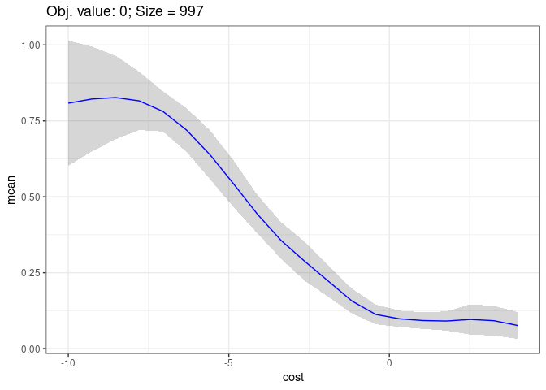

# Explaining Hyperparameter Optimization via PDPs

<!-- -->

This repository gives access to an implementation of the methods
presented in the paper submission “Explaining Hyperparameter
Optimization via PDPs”, as well as all code that was used for the
experimental analysis.

This repository is structured as follows:

``` 
    ├── analysis/               # Scripts used to create figures and tables in the paper
    ├── data/                   # Location where all experimental data is stored
    │   ├── raw/                # Raw datasets for the DNN surrogate benchmark
    │   ├── runs/               # Individual runs 
    ├── benchmarks/             # Code for experimental analysis (section 6)
    │   ├── synthetic           # Synthetic benchmark (section 6.1)
    │   ├── mlp                 # DNN surrogate benchmark (section 6.2)
    ├── renv/                   # renv configuration files to enable a reproducible setup 
    ├── R/                      # Implementation of methods 
    ├── LICENSE
    └── README.md               
```

## Reproducible Setup

To allow for a proper, reproducible setup of the environment we use the
package `renv`.

The project dependencies can be installed via

``` r
library("renv")
renv::restore()
```

## Quick Start

``` r
# Loading all scripts we need
source("R/tree_splitting.R")
source("R/helper.R")
source("R/marginal_effect.R")
source("R/plot_functions.R")
```

First, assume we have a surrogate model that we want to analyze.

Here, for example, we tuned a support vector machine on the `iris` task,
and extracted the surrogate model after the last iteration.

``` r
library(mlr)
library(mlrMBO)
library(e1071)
library(BBmisc)
library(data.table)

par.set = makeParamSet(
  makeNumericParam("cost", -10, 4, trafo = function(x) 2^x),
  makeNumericParam("gamma", -10, 4, trafo = function(x) 2^x)
)

ctrl = makeMBOControl()
ctrl = setMBOControlInfill(ctrl, crit = makeMBOInfillCritCB(cb.lambda = 1))
ctrl = setMBOControlTermination(ctrl, iters = 5)
tune.ctrl = makeTuneControlMBO(mbo.control = ctrl)
res = tuneParams(makeLearner("classif.svm"), iris.task, cv3, par.set = par.set, control = tune.ctrl,
  show.info = FALSE)
  
surrogate =  res$mbo.result$models[[1]]

print(surrogate)
```

    FALSE Model for learner.id=regr.km; learner.class=regr.km
    FALSE Trained on: task.id = data; obs = 13; features = 2
    FALSE Hyperparameters: jitter=TRUE,covtype=matern3_2,optim.method=gen,nugget.estim=TRUE

We are computing the PDP estimate with confidence for hyperparameter
`cost`. We use the `marginal_effect_sd_over_mean` function, which uses
the `iml` packages.

    ##        cost      mean         sd
    ## 1 -9.998017 0.8085137 0.12850346
    ## 2 -9.261563 0.8223581 0.11260680
    ## 3 -8.525109 0.8271599 0.09651956
    ## 4 -7.788655 0.8161618 0.07913981
    ## 5 -7.052201 0.7814865 0.06697429
    ## 6 -6.315747 0.7200586 0.06511970

We visualize the outcome:

``` r
library(ggplot2)

p = plot_pdp_with_uncertainty_1D(me)
print(p)
```

<!-- -->

To improve the uncertainty estimates, we partition the input space. We
perform 2 splits and use the L2-objective.

``` r
predictor = Predictor$new(model = surrogate, data = data)
effects = FeatureEffect$new(predictor = predictor, feature = "cost", method = "pdp")

tree = compute_tree(effects, data, "SS_L2", 2)
```

We now want to visualize the PDP in the node with the best objective
after 1 split.

``` r
plot_pdp_for_node(node = tree[[2]][[2]], testdata = data, model = surrogate, pdp.feature = "cost", grid.size = 20)
```

<!-- -->

## Reproduce Experiments

The steps necessary to reproduce the experiments are described
[here](benchmarks/README.md).
